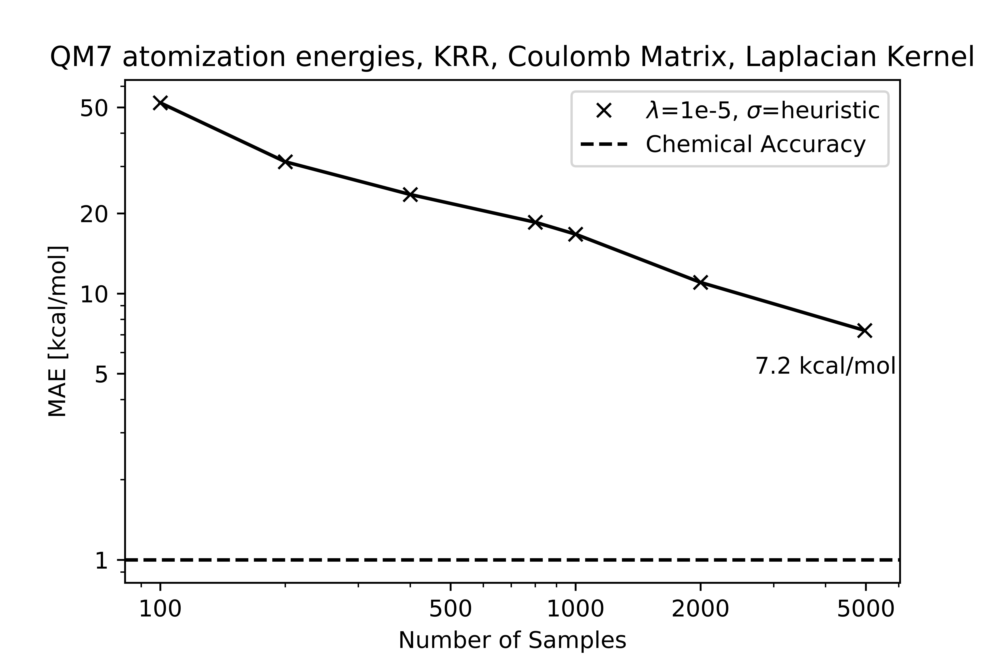

# Learning Curve QM7 dataset

## Assignment

Produce a learning curve for atomization energies in the QM7 dataset.

* Label: atomization energy [kcal/mol]
* Representation: Coulomb matrix, sorted by row-norm
* ML method: KRR
* Kernel: Laplacian Kernel
* Distance: L1-Norm
* Hyperparameters: lambda 1e-5, sigma such that 1/2 <= Kernel <= 1
* Train Size: <= 5k

## Learning Curve

